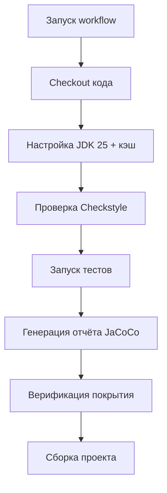

[](https://github.com/aestagsye/devtools/actions/workflows/main.yml)
# Quick Start:
1. ./gradlew run
2. ./gradlew test
# Packages:
1. ru.mentee.power
2. ru.mentee.power.devtools.progress
# Record:
1. MenteeProgress
2. Mentee
# Правило веток: 
Example: feature/DVT-X
# Git локальный цикл: 
Шаги и команды:

git add . -> git commit -> git push
## Сценарий ручной проверки DVT-6

### Запуск приложения
1. Откройте Gradle Tool Window (View → Tool Windows → Gradle)
2. Выполните: devtools → Tasks → application → run
3. Ожидаемый вывод в Run Tool Window:
   Суммарно: пройдено 25 из 36 уроков, осталось 11 уроков

### Запуск тестов
1. Откройте Gradle Tool Window
2. Выполните: devtools → Tasks → verification → test
3. Ожидаемый вывод: BUILD SUCCESSFUL, все тесты зелёные

### Отладка через Debug
1. Установите breakpoint на строке цикла while в ProgressTracker.calculateProgress
2. Запустите Debug: кликните правой кнопкой на main → Debug 'ProgressTracker.main()'
3. Используйте Step Over (F8) для прохождения итераций
4. Проверьте Variables: counter, remainingHours должны изменяться корректно
5. Используйте Evaluate Expression (Alt+F8): вычислите remainingLessons * 2
6. Ожидаемый результат Evaluate: 14 (для completedLessons=5, totalLessons=12)

### Что делать при ошибках
- Если вывод некорректен: проверьте логику цикла через Debug
- Если тесты красные: откройте вывод теста, найдите AssertionError, скорректируйте метод
- Если Debug не останавливается: убедитесь, что breakpoint установлен (красный кружок)

## Кодстайл-гайд проекта devtools

Проект следует правилам Google Java Style Guide с адаптацией.
Автоматическая проверка: ./gradlew checkstyleMain

### 1. Именование методов: camelCase

До:    public void add_student(Student s) { }
После: public void addStudent(Student student) { }

Почему: Java Convention требует camelCase для методов.
Источник: https://google.github.io/styleguide/javaguide.html#s5.3-camel-case

### 2. Пробелы после if/for/while

До:    if(condition) {
После: if (condition) {

Почему: улучшает читаемость, отделяет ключевое слово от выражения.
Источник: Oracle Code Conventions — Whitespace

### 3. Длина строки: максимум 120 символов

До:    public List getStudentsFromSpecificCityWithVeryLongName...
После: public List getStudentsByCity(String city) {

Почему: длинные строки затрудняют чтение в редакторе и при code review.
Источник: https://google.github.io/styleguide/javaguide.html#s4.4-column-limit

### 4. Порядок импортов

До:    import java.util.List; import java.util.ArrayList; import java.io.File;
После: import java.io.File; import java.util.ArrayList; import java.util.List;

Почему: алфавитный порядок упрощает поиск импортов.
Источник: IntelliJ IDEA → Code → Optimize Imports

### 5. Фигурные скобки для if

До:    if (condition) doSomething();
После: if (condition) { doSomething(); }

Почему: скобки обязательны даже для однострочных блоков.
Источник: https://google.github.io/styleguide/javaguide.html#s4.1.1-braces-always-used

## Code Review Checklist

Используйте этот чеклист для само-ревью перед запросом ревью у ментора:

### Функциональность
- [ ] Код решает поставленную задачу полностью
- [ ] Обработаны граничные случаи (null, пустые данные, экстремальные значения)
- [ ] Обработка ошибок реализована корректно

### Тесты
- [ ] Добавлены тесты для нового функционала (или обновлены существующие)
- [ ] Все тесты проходят локально: `./gradlew test`
- [ ] Покрыты позитивные и негативные сценарии
- [ ] JaCoCo coverage ≥ 80% для нового кода

### Читаемость и стиль
- [ ] Имена переменных, методов и классов отражают назначение
- [ ] Нет дублирования кода (DRY principle)
- [ ] Checkstyle проходит без ошибок: `./gradlew checkstyleMain`
- [ ] Нет закомментированного кода или отладочного вывода (`System.out.println`)

### Документация
- [ ] README обновлён (если добавлена новая функциональность)
- [ ] Публичные методы имеют JavaDoc (если применимо)
- [ ] Примеры использования актуальны
- [ ] Runbook обновлён (если изменились команды запуска/проверки)

### Производительность и безопасность
- [ ] Нет очевидных проблем производительности
- [ ] Нет хардкода паролей, токенов или конфиденциальных данных

## Примеры Code Review комментариев

### Хорошие комментарии (конструктивные)

**Пример 1:**

**Проблема:** Метод `calculateDiscount` (строка 45) имеет 3 вложенных if-else и 40 строк.
**Почему это важно:** Сложная логика плохо тестируется и тяжело поддерживается.
**Предложение:** Вынести каждое условие в отдельный метод (например, `isEligibleForBonusDiscount()`)
и использовать паттерн Strategy для разных типов скидок.


**Пример 2:**

**Проблема:** Тест `testProcessOrder` (строка 78) проверяет только успешный сценарий.
**Почему это важно:** Не проверена обработка ошибок при недостаточном балансе.
**Предложение:** Добавить тест `testProcessOrder_InsufficientBalance_ThrowsException()`
с использованием `assertThatThrownBy()`.


### Плохие комментарии (неконструктивные)

**Пример 1:**

Этот код ужасен, полностью переписать.


**Почему плохо:** Нет конкретики (что именно плохо), нет предложения (как исправить),
токсичный тон (демотивирует автора).

**Пример 2:**

Здесь лучше использовать Stream API.


**Почему плохо:** Нет объяснения почему лучше, нет примера как переписать,
неясно какую проблему это решает.

## Результаты само-ревью DVT-9

### Найденные проблемы

#### 1. Нет описания CI в секции README
**Файл:** README.md
**Проблема:** В README нет раздела, объясняющего настройку и работу CI/CD пайплайна
**Почему важно:** Новым разработчикам сложно понять, как работает сборка и тестирование проекта. 
Отсутствует документация по триггерам сборки (push, PR, schedule).
Нет информации о кэшировании зависимостей и оптимизациях.
Неясно, какие артефакты генерируются и где их найти.
Затрудняет дебаггинг при падении сборок.
**Исправление:** Добавить в README.md секцию с описанием CI/CD:
## 🚀 CI/CD Pipeline

Проект использует GitHub Actions для автоматической сборки, проверки качества кода и тестирования.

### 🔧 Основные проверки:
1. **Статический анализ кода** (Checkstyle) — проверка стиля кодирования
2. **Запуск тестов** (JUnit) — проверка корректности работы
3. **Покрытие кода** (JaCoCo) — анализ покрытия тестами и его верификация
4. **Сборка проекта** — финальная компиляция и создание артефактов

### 📁 Конфигурация:
- Файл workflow: `.github/workflows/main.yml`
- Название workflow: **Java CI with Checkstyle and JaCoCo**

### 🚦 Триггеры запуска:
Workflow автоматически запускается при:
- **Push** в ветки: `master`, `feature/**`
- **Pull Request** в ветку: `master`

### 🛠️ Используемые инструменты:
| Инструмент | Назначение | Команда Gradle |
|------------|------------|----------------|
| **Checkstyle** | Проверка стиля кодирования | `checkstyleMain` |
| **JaCoCo** | Анализ покрытия кода тестами | `jacocoTestReport` |
| **JaCoCo Verification** | Проверка минимального покрытия | `jacocoTestCoverageVerification` |
| **JUnit** | Запуск unit-тестов | `test` |

### 💻 Технические детали:
- **ОС**: Ubuntu Latest
- **JDK**: Temurin 25
- **Сборка**: Gradle с кэшированием зависимостей
- **Команда сборки**: `./gradlew --no-daemon`

### 📈 Этапы выполнения:


### 📋 Локальный запуск проверок:
Перед созданием Pull Request рекомендуется выполнить локально:
```bash
# Проверка стиля кодирования
./gradlew checkstyleMain

# Запуск всех тестов
./gradlew test

# Генерация отчёта о покрытии
./gradlew jacocoTestReport

# Проверка покрытия (минимум 80% по умолчанию)
./gradlew jacocoTestCoverageVerification

# Полная сборка (все проверки)
./gradlew build
```

### 📁 Артефакты и отчёты:
После успешного выполнения workflow в разделе Actions доступны:
1. Отчёт Checkstyle о стиле кодирования
2. Результаты выполнения тестов
3. Отчёт JaCoCo о покрытии кода тестами
4. Собранные артефакты проекта

### ⚠️ Важно:
- Pull Request в ветку `master` будет проверен автоматически
- Для веток `feature/**` проверка запускается при каждом push
- Минимальные требования к покрытию кода заданы в `jacocoTestCoverageVerification`
- Кэширование Gradle зависимостей ускоряет сборку на ~60%

---

#### 2. Забыт отладочный вывод
**Файл:** src/main/java/ru/mentee/power/devtools/ProgressDemo.java (строка 14)
**Проблема:** Оставлен `System.out.println("Debug: starting loop")`
**Почему важно:** Отладочный вывод замусоривает логи production-приложения и создаёт впечатление небрежности.
**Исправление:** Удалить строку или заменить на logger (если логирование настроено).

#### 3. Закомментированный код
**Файл:** src/main/java/ru/mentee/power/devtools/ProgressDemo.java (строка 16)
**Проблема:** Закомментирована 1 строка вывода суммы прогресса
**Почему важно:** Закомментированный код создаёт путаницу: непонятно зачем он сохранён и актуален ли.
Если нужна история изменений — она в Git.
**Исправление:** Удалить закомментированный код. Если нужна старая версия — посмотреть в Git History.

https://mentee-power.xl.ru/learn/MCIneBj4KkyH-GIRCspFvA/theory

