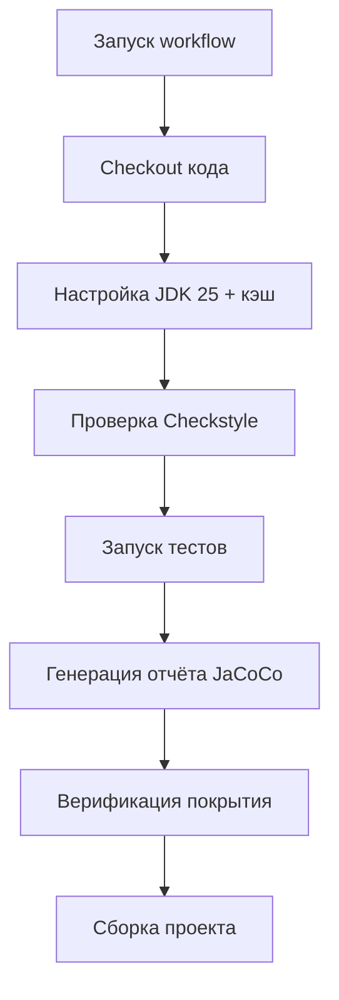

[](https://github.com/aestagsye/devtools/actions/workflows/main.yml)
## Технологический стек проекта

### Языки и платформы
- **Java 25 LTS** — основной язык разработки
- **Gradle 8.x** — система сборки (через Gradle Wrapper)

### Инструменты качества кода
- **Checkstyle** — статический анализ стиля кода
    - Конфигурация: `config/checkstyle/checkstyle.xml`
    - Запуск: `./gradlew checkstyleMain`
- **JUnit 5** — фреймворк тестирования
    - Запуск: `./gradlew test`

### CI/CD
- **GitHub Actions** — автоматическая проверка PR
    - Checkstyle на каждый коммит
    - Тесты на каждый коммит
    - Конфигурация: `.github/workflows/`

### Правила кода
- Стиль: Google Java Style Guide (через Checkstyle)
- Коммиты: Conventional Commits (`feat:`, `fix:`, `docs:`)
- Ветки: `feature/DVT-X` для задач, `master` — основная
- Pull Request: обязателен для слияния в master

# Quick Start:
1. ./gradlew run
2. ./gradlew test
# Packages:
1. ru.mentee.power
2. ru.mentee.power.devtools.progress
# Record:
1. MenteeProgress
2. Mentee
# Правило веток: 
Example: feature/DVT-X
# Git локальный цикл: 
Шаги и команды:

git add . -> git commit -> git push
## Сценарий ручной проверки DVT-6

### Запуск приложения
1. Откройте Gradle Tool Window (View → Tool Windows → Gradle)
2. Выполните: devtools → Tasks → application → run
3. Ожидаемый вывод в Run Tool Window:
   Суммарно: пройдено 25 из 36 уроков, осталось 11 уроков

### Запуск тестов
1. Откройте Gradle Tool Window
2. Выполните: devtools → Tasks → verification → test
3. Ожидаемый вывод: BUILD SUCCESSFUL, все тесты зелёные

### Отладка через Debug
1. Установите breakpoint на строке цикла while в ProgressTracker.calculateProgress
2. Запустите Debug: кликните правой кнопкой на main → Debug 'ProgressTracker.main()'
3. Используйте Step Over (F8) для прохождения итераций
4. Проверьте Variables: counter, remainingHours должны изменяться корректно
5. Используйте Evaluate Expression (Alt+F8): вычислите remainingLessons * 2
6. Ожидаемый результат Evaluate: 14 (для completedLessons=5, totalLessons=12)

### Что делать при ошибках
- Если вывод некорректен: проверьте логику цикла через Debug
- Если тесты красные: откройте вывод теста, найдите AssertionError, скорректируйте метод
- Если Debug не останавливается: убедитесь, что breakpoint установлен (красный кружок)

## Кодстайл-гайд проекта devtools

Проект следует правилам Google Java Style Guide с адаптацией.
Автоматическая проверка: ./gradlew checkstyleMain

### 1. Именование методов: camelCase

До:    public void add_student(Student s) { }
После: public void addStudent(Student student) { }

Почему: Java Convention требует camelCase для методов.
Источник: https://google.github.io/styleguide/javaguide.html#s5.3-camel-case

### 2. Пробелы после if/for/while

До:    if(condition) {
После: if (condition) {

Почему: улучшает читаемость, отделяет ключевое слово от выражения.
Источник: Oracle Code Conventions — Whitespace

### 3. Длина строки: максимум 120 символов

До:    public List getStudentsFromSpecificCityWithVeryLongName...
После: public List getStudentsByCity(String city) {

Почему: длинные строки затрудняют чтение в редакторе и при code review.
Источник: https://google.github.io/styleguide/javaguide.html#s4.4-column-limit

### 4. Порядок импортов

До:    import java.util.List; import java.util.ArrayList; import java.io.File;
После: import java.io.File; import java.util.ArrayList; import java.util.List;

Почему: алфавитный порядок упрощает поиск импортов.
Источник: IntelliJ IDEA → Code → Optimize Imports

### 5. Фигурные скобки для if

До:    if (condition) doSomething();
После: if (condition) { doSomething(); }

Почему: скобки обязательны даже для однострочных блоков.
Источник: https://google.github.io/styleguide/javaguide.html#s4.1.1-braces-always-used

## Code Review Checklist

Используйте этот чеклист для само-ревью перед запросом ревью у ментора:

### Функциональность
- [ ] Код решает поставленную задачу полностью
- [ ] Обработаны граничные случаи (null, пустые данные, экстремальные значения)
- [ ] Обработка ошибок реализована корректно

### Тесты
- [ ] Добавлены тесты для нового функционала (или обновлены существующие)
- [ ] Все тесты проходят локально: `./gradlew test`
- [ ] Покрыты позитивные и негативные сценарии
- [ ] JaCoCo coverage ≥ 80% для нового кода

### Читаемость и стиль
- [ ] Имена переменных, методов и классов отражают назначение
- [ ] Нет дублирования кода (DRY principle)
- [ ] Checkstyle проходит без ошибок: `./gradlew checkstyleMain`
- [ ] Нет закомментированного кода или отладочного вывода (`System.out.println`)

### Документация
- [ ] README обновлён (если добавлена новая функциональность)
- [ ] Публичные методы имеют JavaDoc (если применимо)
- [ ] Примеры использования актуальны
- [ ] Runbook обновлён (если изменились команды запуска/проверки)

### Производительность и безопасность
- [ ] Нет очевидных проблем производительности
- [ ] Нет хардкода паролей, токенов или конфиденциальных данных

## Примеры Code Review комментариев

### Хорошие комментарии (конструктивные)

**Пример 1:**

**Проблема:** Метод `calculateDiscount` (строка 45) имеет 3 вложенных if-else и 40 строк.
**Почему это важно:** Сложная логика плохо тестируется и тяжело поддерживается.
**Предложение:** Вынести каждое условие в отдельный метод (например, `isEligibleForBonusDiscount()`)
и использовать паттерн Strategy для разных типов скидок.


**Пример 2:**

**Проблема:** Тест `testProcessOrder` (строка 78) проверяет только успешный сценарий.
**Почему это важно:** Не проверена обработка ошибок при недостаточном балансе.
**Предложение:** Добавить тест `testProcessOrder_InsufficientBalance_ThrowsException()`
с использованием `assertThatThrownBy()`.


### Плохие комментарии (неконструктивные)

**Пример 1:**

Этот код ужасен, полностью переписать.


**Почему плохо:** Нет конкретики (что именно плохо), нет предложения (как исправить),
токсичный тон (демотивирует автора).

**Пример 2:**

Здесь лучше использовать Stream API.


**Почему плохо:** Нет объяснения почему лучше, нет примера как переписать,
неясно какую проблему это решает.

## Результаты само-ревью DVT-9

### Найденные проблемы

#### 1. Нет описания CI в секции README
**Файл:** README.md
**Проблема:** В README нет раздела, объясняющего настройку и работу CI/CD пайплайна
**Почему важно:** Новым разработчикам сложно понять, как работает сборка и тестирование проекта. 
Отсутствует документация по триггерам сборки (push, PR, schedule).
Нет информации о кэшировании зависимостей и оптимизациях.
Неясно, какие артефакты генерируются и где их найти.
Затрудняет дебаггинг при падении сборок.
**Исправление:** Добавить в README.md секцию с описанием CI/CD:
## 🚀 CI/CD Pipeline

Проект использует GitHub Actions для автоматической сборки, проверки качества кода и тестирования.

### 🔧 Основные проверки:
1. **Статический анализ кода** (Checkstyle) — проверка стиля кодирования
2. **Запуск тестов** (JUnit) — проверка корректности работы
3. **Покрытие кода** (JaCoCo) — анализ покрытия тестами и его верификация
4. **Сборка проекта** — финальная компиляция и создание артефактов

### 📁 Конфигурация:
- Файл workflow: `.github/workflows/main.yml`
- Название workflow: **Java CI with Checkstyle and JaCoCo**

### 🚦 Триггеры запуска:
Workflow автоматически запускается при:
- **Push** в ветки: `master`, `feature/**`
- **Pull Request** в ветку: `master`

### 🛠️ Используемые инструменты:
| Инструмент | Назначение | Команда Gradle |
|------------|------------|----------------|
| **Checkstyle** | Проверка стиля кодирования | `checkstyleMain` |
| **JaCoCo** | Анализ покрытия кода тестами | `jacocoTestReport` |
| **JaCoCo Verification** | Проверка минимального покрытия | `jacocoTestCoverageVerification` |
| **JUnit** | Запуск unit-тестов | `test` |

### 💻 Технические детали:
- **ОС**: Ubuntu Latest
- **JDK**: Temurin 25
- **Сборка**: Gradle с кэшированием зависимостей
- **Команда сборки**: `./gradlew --no-daemon`

### 📈 Этапы выполнения:


### 📋 Локальный запуск проверок:
Перед созданием Pull Request рекомендуется выполнить локально:
```bash
# Проверка стиля кодирования
./gradlew checkstyleMain

# Запуск всех тестов
./gradlew test

# Генерация отчёта о покрытии
./gradlew jacocoTestReport

# Проверка покрытия (минимум 80% по умолчанию)
./gradlew jacocoTestCoverageVerification

# Полная сборка (все проверки)
./gradlew build
```

### 📁 Артефакты и отчёты:
После успешного выполнения workflow в разделе Actions доступны:
1. Отчёт Checkstyle о стиле кодирования
2. Результаты выполнения тестов
3. Отчёт JaCoCo о покрытии кода тестами
4. Собранные артефакты проекта

### ⚠️ Важно:
- Pull Request в ветку `master` будет проверен автоматически
- Для веток `feature/**` проверка запускается при каждом push
- Минимальные требования к покрытию кода заданы в `jacocoTestCoverageVerification`
- Кэширование Gradle зависимостей ускоряет сборку на ~60%

---

#### 2. Забыт отладочный вывод
**Файл:** src/main/java/ru/mentee/power/devtools/ProgressDemo.java (строка 14)
**Проблема:** Оставлен `System.out.println("Debug: starting loop")`
**Почему важно:** Отладочный вывод замусоривает логи production-приложения и создаёт впечатление небрежности.
**Исправление:** Удалить строку или заменить на logger (если логирование настроено).

#### 3. Закомментированный код
**Файл:** src/main/java/ru/mentee/power/devtools/ProgressDemo.java (строка 16)
**Проблема:** Закомментирована 1 строка вывода суммы прогресса
**Почему важно:** Закомментированный код создаёт путаницу: непонятно зачем он сохранён и актуален ли.
Если нужна история изменений — она в Git.
**Исправление:** Удалить закомментированный код. Если нужна старая версия — посмотреть в Git History.

## Информационный поиск — результаты DVT-11

### Запросы и источники

| № | Запрос               | Операторы | Официальный источник | Альтернатива                                                        | Статус | Дата проверки |
|---|----------------------|-----------|----------------------|---------------------------------------------------------------------|--------|---------------|
| 1 | Lombok Gradle Short  |site:search.maven.org "lombok" OR site:mvnrepository.com "lombok" |https://central.sonatype.com/artifact/org.projectlombok/lombok/1.18.42 | https://mvnrepository.com/artifact/org.projectlombok/lombok/1.18.42 | 200 OK | 11.01.2026    |
| 2 | Java Stream API      |site:docs.oracle.com "stream api" intitle:api java 25 |https://docs.oracle.com/en/middleware/standalone/coherence/15.1.1/develop-applications/using-repository-api.html#GUID-6FE2A09E-71FF-4D65-AB04-972B95BA87D6 | -                                                                   | 200 OK | 11.01.2026    |
| 3 | IntelliJ IDEA Keymap |site:www.jetbrains.com/help "keymap" "intellij idea" |https://www.jetbrains.com/help/idea/settings-keymap.html | -                                                                   | 200 OK | 11.01.2026    |

### AI-промпты и сравнение ассистентов

#### Промпт 1: План решения

**Задача:** Нужно добавить объявление переменной Valeria в класс ProgressDemo 
**Контекст:** Java 25, у меня есть record MenteeProgress, именно объект этого рекорда нужно объявить, проект на Gradle
**Ограничения:** -
**Ожидаемый результат:** план из 3-5 шагов, объяснение "почему именно так", НЕ пиши код — я реализую сам
**Критерии успеха:** объект рекорда MenteeProgress объявлен

**AI-1 (Deepseek):**

## План решения: Добавление объявления переменной Valeria

### Шаг 1: Анализ существующего кода
**Что делаем:** Изучите текущую реализацию ProgressDemo.java
**Почему:** Нужно понять структуру класса, чтобы правильно добавить новую переменную
**Ожидаемый результат:** Вы увидите, что уже есть объект `heshegto` и переменная `progress`, присвоенная ему

### Шаг 2: Определение параметров для Valeria
**Что делаем:** Решите, какие значения передать в конструктор MenteeProgress для Valeria
**Почему:** Record MenteeProgress требует три параметра: имя, номер спринта, запланированные часы
**Ожидаемый результат:** Вы определите конкретные значения: имя "Valeria", номер спринта (например, 1 или следующий), часы (например, 6)

### Шаг 3: Создание объекта record
**Что делаем:** Написать объявление переменной Valeria с использованием оператора `new`
**Почему:** Record в Java создаётся через конструктор с указанием всех полей
**Ожидаемый результат:** Строка вида `MenteeProgress valeria = new MenteeProgress("Valeria", 1, 6);`

### Шаг 4: Расположение в коде
**Что делаем:** Решить, где разместить новое объявление в классе ProgressDemo
**Почему:** Логически переменную стоит объявлять рядом с существующей `heshegto`, но перед её использованием
**Ожидаемый результат:** Вы добавите объявление в метод main() после объявления `heshegto`, но перед работой с `progress`

### Шаг 5: Использование новой переменной (опционально)
**Что делаем:** Решить, нужно ли выводить информацию о Valeria так же, как о heshegto
**Почему:** Для демонстрации работы можно добавить аналогичный вывод
**Ожидаемый результат:** Принятие решения о добавлении вывода summary() и проверки readyForSprint() для Valeria

### Объяснение "почему именно так":
1. **Record объявляется через new** — потому что record в Java это неизменяемый класс с автоматически генерируемым конструктором
2. **Имя переменной в camelCase** — потому что следуем Java Code Conventions (valeria вместо Valeria)
3. **Параметры в конструкторе** — record MenteeProgress требует три параметра в строгом порядке, определённом в его объявлении
4. **Размещение в начале метода** — для лучшей читаемости кода все объявления переменных должны быть в начале блока
5. **Использование явного типа или var** — можно использовать либо явный тип `MenteeProgress`, либо `var`, но var предпочтительнее для локальных переменных в Java 10+

### Критерии успеха:
1. Объект record MenteeProgress успешно создан
2. Переменная корректно объявлена в классе ProgressDemo
3. Конструктор получает правильные параметры в правильном порядке
4. Код компилируется без ошибок
5. При запуске программы информация о Valeria корректно обрабатывается (если добавлен вывод)

**Не пишите код** — используйте этот план как инструкцию для самостоятельной реализации. После выполнения проверьте, что программа компилируется и работает как ожидается.

**AI-2 (ChatGPT):**

Хорошо, давай разложим это **концептуально**, без кода, как ты и просишь.

## План из 4 шагов

### 1. Определи место объявления переменной

Переменная `Valeria` должна быть объявлена **в классе `ProgressDemo`**, в том же контексте, где уже создаются объекты типа `MenteeProgress`.
Почему: объект рекорда — это обычный объект, и его жизненный цикл должен совпадать с местом использования (в `main`, а не в самом рекорде).

---

### 2. Используй тип `MenteeProgress`, а не `var` для первого объявления

Объявляя `Valeria`, укажи явный тип `MenteeProgress`.
Почему:

* это делает учебный пример прозрачным (ты явно показываешь, что работаешь с record),
* в демо-классе читаемость важнее краткости,
* Java 25 `var` — это синтаксический сахар, а не замена пониманию типов.

---

### 3. Инициализируй объект через конструктор рекорда

Создай объект `Valeria`, передав значения, соответствующие полям рекорда: имя, номер спринта, часы.
Почему:

* record **не имеет сеттеров**,
* все данные должны быть заданы **один раз при создании**,
* это ключевая идея record как неизменяемой модели данных.

---

### 4. Убедись, что объект реально используется

Проверь, что объявленный объект `Valeria` либо:

* участвует в выводе (`summary`, `readyForSprint`),
* либо явно используется как демонстрационный объект.

Почему:

* критерий успеха — не просто объявление, а **осмысленное существование объекта**,
* неиспользуемые переменные — сигнал логической ошибки или незавершённого шага.

---

## Почему именно так (коротко)

* `record` = неизменяемая модель → всё задаётся при создании
* `ProgressDemo` = точка входа → здесь создаются объекты
* Явный тип = лучшее понимание, особенно в обучающем проекте
* Использование объекта = подтверждение, что цель достигнута

Если хочешь, следующим шагом можем:

* проверить, **правильно ли ты выбрал значения для Valeria**,
* или обсудить, **когда уместно `var`, а когда — нет**,
* или усложнить пример (список `MenteeProgress`, Stream API).


**Сравнение:** Обе нейросети составили план из 4 шагов, мало что различалось, были различия лишь в отдельных шагах и в том, что в ChatGPT оформление чуть красивее
Мой выбор зависит от доступности ВПНа, если он доступен, то я всегда выбираю  Chatgpt, если нет, то Deepseek. Ведь первая нейросеть вроде как мощнее

#### Промпт 2: Проверка кода

**Код для проверки:**

if (progress.readyForSprint()) {
System.out.println("Status: sprint ready");
} else {
System.out.println("Status: backlog first");
}

**Что проверить:**
1. Логические ошибки
2. Соответствие Code Conventions
3. Производительность

**AI-1 (Deepseek):**

## Результат проверки кода:

### 1. Логические ошибки

**Проблема:**
- Код не проверяет **граничные случаи**
- Отсутствует обработка **null-значений**

**Что не так:**
- Если `progress == null`, вызов `progress.readyForSprint()` вызовет `NullPointerException`
- Не проверяет, какие значения `plannedHoursPerWeek` считаются допустимыми (отрицательные? нулевые?)

**Как исправить:**
```java
// Вариант 1: Проверка на null перед вызовом
if (progress != null && progress.readyForSprint()) {
    // ...
}

// Вариант 2: Использовать Optional для безопасной обработки
Optional.ofNullable(progress)
    .ifPresentOrElse(
        p -> System.out.println(p.readyForSprint() ? "Status: sprint ready" : "Status: backlog first"),
        () -> System.out.println("Status: no progress data")
    );
```

### 2. Соответствие Code Conventions

**Проблемы:**
- **Стиль фигурных скобок** — в Oracle Code Conventions рекомендуется размещать `{` на той же строке
- **Именование переменных** — `heshegto` нарушает Java Naming Conventions (должно быть в camelCase)
- **Комментарии** — избыточные комментарии в ProgressDemo.java

**Что не соответствует:**
1. **Oracle Java Code Conventions (раздел 4.1):** `{` должна быть на той же строке, что и условие
2. **Java Naming Conventions:**
   - Имена классов: `UpperCamelCase`
   - Имена переменных: `lowerCamelCase`
   - Константы: `UPPER_SNAKE_CASE`
3. **Читаемость:** Длинные строки нарушают рекомендуемый лимит 80-120 символов

**Как исправить:**
```java
// Текущий стиль (K&R) → Oracle рекомендует (Same Line)
if (progress.readyForSprint()) {
    System.out.println("Status: sprint ready");
} else {
    System.out.println("Status: backlog first");
}
// Уже соответствует!
```

### 3. Производительность

**Проблемы:**
- **Избыточные вызовы метода** — `readyForSprint()` вызывается только один раз, что корректно
- **Строковые операции** — `String.format()` в `summary()` менее производителен, чем `String.concat()` для простых случаев
- **Вывод в консоль** — `System.out.println()` синхронизирован, что может быть бутылочным горлышком

**Что неэффективно:**
1. **System.out.println()** — синхронизированный метод, медленный в многопоточных сценариях
2. **String.formatted()** — создаёт Formatter, что дороже простой конкатенации для 3 аргументов

**Как улучшить:**
```java
// 1. Использовать StringBuilder для сложных строк
StringBuilder status = new StringBuilder("Status: ");
status.append(progress.readyForSprint() ? "sprint ready" : "backlog first");
System.out.println(status);

// 2. Кэшировать результат readyForSprint(), если вызывается многократно
boolean isReady = progress.readyForSprint();

// 3. Использовать logger вместо System.out для production кода
import java.util.logging.Logger;
private static final Logger LOG = Logger.getLogger(ProgressDemo.class.getName());
LOG.info("Status: " + (isReady ? "sprint ready" : "backlog first"));
```

### Общие рекомендации:

**Логика:**
- Добавить проверку на null
- Добавить валидацию входных данных в конструкторе MenteeProgress

**Code Conventions:**
- Исправить именование переменной `heshegto` → `heshegtoProgress`
- Удалить избыточные комментарии
- Проверить длину строк (не более 120 символов)

**Производительность:**
- Рассмотреть замену System.out на логгер
- Для summary() использовать конкатенацию вместо formatted(), если нужна максимальная производительность
- Выносить повторяющиеся вычисления в локальные переменные

**Потенциальные уязвимости:**
- Нет защиты от переполнения (если plannedHoursPerWeek очень большое число)
- Record immutable, что хорошо, но нужно валидировать входные данные

**Код соответствует Code Conventions**, но требует доработки в части **null-безопасности** и может быть **оптимизирован** для production использования.

**AI-2 (ChatGPT):**

Разберём этот фрагмент по трём пунктам, **без переписывания кода**.

---

## 1. Логические ошибки

**Что проверить:**

* Метод `readyForSprint()` возвращает `boolean`, и его семантика совпадает с текстом сообщений.
* Условие читается однозначно:
  `true → "sprint ready"`
  `false → "backlog first"`

**Вывод:**
Логических ошибок нет, если:

* `readyForSprint()` действительно означает «достаточно часов для спринта»
* порог (≥ 3 часов) соответствует бизнес-смыслу задачи

В текущем контексте логика корректна и не двусмысленна.

---

## 2. Соответствие Code Conventions (Java)

**Плюсы:**

* Используется явный `if / else`, а не тернарный оператор → читаемо
* Фигурные скобки есть у обеих веток → соответствует Java Code Conventions
* Имена методов и переменных:

   * `readyForSprint()` — глагольная форма, boolean-семантика ✔
   * `progress` — понятное существительное ✔
* Строки вывода — читаемые, без «магических» сокращений

**Что можно проверить дополнительно (не обязательно менять):**

* Язык сообщений (`Status: ...`) — единый ли он по всему проекту
* Не дублируется ли логика вывода в других местах

**Вывод:**
Код полностью соответствует Java Code Conventions для учебного и продакшн-кода.

---

## 3. Производительность

**Факты:**

* Один вызов `readyForSprint()`
* Примитивный boolean
* Два `println`
* Никаких аллокаций в условии
* Никаких коллекций или I/O, кроме stdout

**Оценка:**
Производительность **оптимальная по определению**.
Даже при тысячах вызовов разницы не будет.

**Важно:**
Оптимизировать здесь **нечего и не нужно** — любые попытки «ускорить» этот код ухудшат читаемость без выигрыша.

---

## Итог

| Критерий           | Оценка                  |
| ------------------ | ----------------------- |
| Логика             | ✅ корректна             |
| Code Conventions   | ✅ соблюдены             |
| Производительность | ✅ избыточно достаточная |

Если хочешь, следующим шагом можем разобрать:

* стоит ли выносить этот `if` в метод
* как оформить статус как enum
* или как это выглядело бы в Stream / functional-стиле (и почему это здесь **не нужно**)


**Сравнение:**
Deepseek оказался более строгим по сравнению с ChatGPT, и нашел больше ошибок в стиле кода, логике и производительности,
в то время как ChatGPT нашел лишь плюсы. Думаю в этом случае дипсик оказался полезнее, ведь он выявил ошибки

## Личный глоссарий терминов Dev Tools

### Структура глоссария

Каждый термин содержит:
- **RU / EN** — русское и английское название
- **Определение** — краткое (1-2 предложения) объяснение термина
- **Контекст использования** — где и когда применяется
- **Пример** — конкретное применение в коде/команде/документации
- **Источник** — ссылка на официальную документацию

---

### Категория: Java-экосистема

#### JDK — Java Development Kit

**Определение:** Development environment for building applications using the Java programming language. Includes compiler (javac), archiver (jar), documentation generator (javadoc), and other tools.

**Контекст использования:** JDK необходим для компиляции Java-кода в байт-код и создания исполняемых JAR-файлов. Без JDK невозможно собрать Java-проект.

**Пример:** После установки JDK выполняем `java -version` для проверки версии. В IntelliJ IDEA настраиваем Project SDK: File → Project Structure → Project → SDK → выбираем JDK 25.

**Источник:** https://docs.oracle.com/en/java/javase/21/docs/

---

#### JRE — Java Runtime Environment

**Определение:** An environment that provides the libraries, Java Virtual Machine, and other components required to run Java applications.

**Контекст использования:** Used to execute Java applications without providing development tools such as compilers.

**Пример:** CI-сервер запускает собранное Java-приложение devtools с использованием JRE.

**Источник:** https://docs.oracle.com/en/java/javase/

---

####  JVM - Java Virtual Machine

**Определение:** An abstract computing machine that enables a computer to run Java programs by executing Java bytecode.

**Контекст использования:** Responsible for memory management, execution of bytecode, and platform independence of Java applications.

**Пример:** JVM выполняет байткод devtools-приложения при запуске через Gradle.

**Источник:** https://docs.oracle.com/javase/specs/

---

####  Gradle Wrapper — Gradle Wrapper

**Определение:** A mechanism that allows a project to be built with a specific Gradle version without requiring Gradle to be installed globally.

**Контекст использования:** Ensures consistent build behavior across different environments and developers.

**Пример:** Проект devtools использует Gradle Wrapper для сборки без установки Gradle вручную.

**Источник:** https://docs.gradle.org/current/userguide/gradle_wrapper.html

---

####  Build Tool — Build Tool

**Определение:** Software that automates the process of compiling source code, managing dependencies, and producing executable artifacts.

**Контекст использования:** Used to standardize and automate project builds.

**Пример:** Gradle используется как Build Tool в проекте devtools.

**Источник:** https://docs.gradle.org/current/userguide/userguide.html

---

####  Dependency — Dependency

**Определение:** An external library or module that a project requires to compile, run, or test.

**Контекст использования:** Declared in build configuration files and resolved automatically by the build tool.

**Пример:** JUnit добавлен как dependency для написания тестов в devtools.

**Источник:** https://docs.gradle.org/current/userguide/dependency_management.html

---

####  Artifact — Artifact

**Определение:** A file produced by a build process, such as a JAR or WAR, that can be published and reused.

**Контекст использования:** Represents the output of a build and can be stored in repositories.

**Пример:** После сборки devtools создаётся JAR-artifact.

**Источник:** https://maven.apache.org/guides/introduction/introduction-to-the-pom.html

---

### Категория: Инструменты разработки

#### IDE — Integrated Development Environment

**Определение:** A software application that provides comprehensive facilities to computer programmers for software development.

**Контекст использования:** Combines code editor, debugger, and build tools in a single interface.

**Пример:** IntelliJ IDEA используется как IDE для разработки devtools.

**Источник:** https://www.jetbrains.com/help/idea/

---

#### SDK — Software Development Kit

**Определение:** A collection of software tools and libraries used to develop applications for a specific platform.

**Контекст использования:** Provides APIs, libraries, and documentation for development.

**Пример:** JDK используется как SDK для Java-разработки в devtools.

**Источник:** https://en.wikipedia.org/wiki/Software_development_kit
---

#### Git — Git

**Определение:** A distributed version control system designed to handle everything from small to very large projects with speed and efficiency.

**Контекст использования:** A distributed version control system designed to handle everything from small to very large projects with speed and efficiency.

**Пример:** Исходный код devtools хранится в Git-репозитории.

**Источник:** https://git-scm.com/docs

---

#### Repository — Repository

**Определение:** A storage location for software packages or source code, managed by a version control system.

**Контекст использования:** Used to store, track, and manage code history.

**Пример:** Проект devtools размещён в Git-repository на GitHub.

**Источник:** https://git-scm.com/docs/gitglossary

---

#### Commit — Commit

**Определение:** A snapshot of changes in a Git repository, recorded with a message and unique identifier.

**Контекст использования:** Used to save logical units of work in version control.

**Пример:** Добавление глоссария зафиксировано отдельным commit.

**Источник:** https://git-scm.com/docs/git-commit

---

#### Branch — Branch

**Определение:** A movable pointer to a sequence of commits, representing an independent line of development.

**Контекст использования:** Allows parallel development without affecting the main codebase.

**Пример:** Для DVT-12 создана отдельная branch.

**Источник:** https://git-scm.com/docs/git-branch

---

### Категория: Процессы и практики

#### Code Review — Code Review

**Определение:** A systematic examination of source code intended to find and fix mistakes and improve code quality.

**Контекст использования:** Performed before merging changes into the main branch.

**Пример:** Pull Request devtools проходит Code Review перед merge.

**Источник:** https://martinfowler.com/articles/code-review/

---

#### CI/CD — Continuous Integration / Continuous Delivery

**Определение:** A set of practices that automate the integration, testing, and delivery of code changes.

**Контекст использования:** Ensures fast and reliable software delivery.

**Пример:** CI/CD запускает сборку devtools при каждом коммите.

**Источник:** https://www.atlassian.com/continuous-delivery

---

## Вопросы по сложным терминам

### Вопрос 1: [Runbook]

**Задача:** [Каждый раз вижу в уроках и каждый раз забываю зачем он нужен]

**Контекст:** [В уроках на платформе]

**Ограничения:** [Гуглил и спрашивал у нейросетей]

**Ожидаемый результат:** [Чёткое понимание термина и зачем Runbook нужен]

**Критерии успеха:** [Могу объяснить другу, что такое Runbook]

---

### Вопрос 2: [JDK, JRE, JVM]

**Задача:** [Не могу понять разницу между JDK, JRE и JVM — когда какой нужен?]

**Контекст:** [Есть маленькое недопонимание разве что, а так в целом понятно, что эти определения находятся
на разных уровнях: JDK -> JRE -> JVM, JDK содержит JRE и инструменты разработки, JRE содержит JVM и библиотеки, 
JVM читает байт-код]

**Ограничения:** [Гуглил]

**Ожидаемый результат:** [чёткое понимание этих терминов]

**Критерии успеха:** [могу четко объяснить эти термины другу]

https://mentee-power.xl.ru/learn/MCIneBj4KkyH-GIRCspFvA/theory

